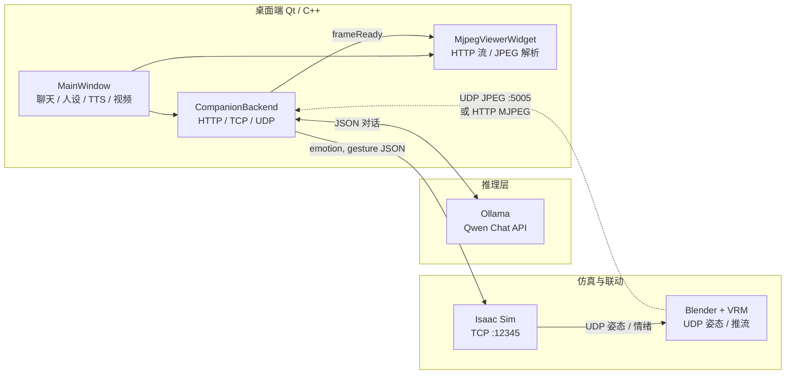

# EmoBot — 陪伴系统（Dream Companion）

全栈感知的 **数字人陪伴 + 具身联动** 实验项目：桌面端用 **C++/Qt** 做产品与编排，**大语言模型**负责对话与人设，**Isaac Sim / Blender** 负责机器人驱动与 VRM 可视化，并打通 **TTS、表情指令与实时画面回传**。
致谢+需准备：blender， Unitree-H1， Qt，ollama，tts

## 启动顺序：

- 启动 Isaac：python server/isaac_controller.py (监听 TCP 12345)
- 启动 Blender：打开模型（models/h12h12vrm.blend)，运行 UDP 接收与 JPEG 发送脚本。
- 启动 Ollama：ollama serve。(根据电脑配置选择LLM模型，本项目用的qwen2.5:14b)
- 启动 Qt 客户端：进入 qt_companion 运行编译好的二进制文件。

## 项目亮点

- **跨语言、跨进程产品层**：在 Qt Widgets 中完成聊天、人设、状态与多媒体控件，将原先分散在 Python 脚本中的 **LLM 调用、Isaac 指令下发、TTS 播放** 收敛到可发布的桌面形态，体现 **工程化与边界划分** 能力。
- **端侧大模型集成**：对接 **Ollama / Qwen** 的 HTTP Chat API，配合 **结构化 JSON 输出**（reply / emotion / gesture），并在 UI 层做 **容错解析**（代码块、非严格 JSON、安全降级），避免把原始字典暴露给用户。
- **多模态与实时链路**：支持 **HTTP MJPEG**（如 viewport/屏幕管线）与 **UDP JPEG 分片重组**（`FF D8`～`FF D9` 级拼帧），适配 Blender 侧不同推流方式；理解 **低延迟展示** 对陪伴类产品的重要性。
- **与仿真 / 视效管线联动**：通过 **TCP** 将语义层「情绪 + 动作」送到 Isaac Sim；仿真侧再通过 **UDP** 同步姿态与情绪到 Blender 中的 VRM，形成 **LLM → 控制 → 数字人表现** 的闭环思路。
- **交互与体验**：类即时通讯的 **气泡、未读提示、智能吸底滚屏**；**Edge-TTS + ffplay** 的语音播报与界面状态联动；资源与头像走 **Qt 资源系统**，便于分发。
- **可靠性与可维护性**：会话重置时的 **布局安全清理**（避免双重释放）；网络与流式协议的 **防御式解析**；提供 **无界面 `--selftest`** 做冒烟测试。

---

## 技术架构

整体采用 **「编排层（Qt/C++）+ 推理服务（Ollama）+ 仿真/视效（Python 生态）」** 的分层结构：C++ 负责 **I/O、状态机、网络、UI**；Python 脚本常驻仿真与 Blender 侧，专注 **领域逻辑与 DCC/仿真 API**。



**数据流简述**

| 方向 | 协议 / 形态 | 内容 |
|------|----------------|------|
| Qt → Ollama | HTTP `POST /api/chat` | 多轮 messages + system persona，模型输出结构化 JSON |
| Qt → Isaac Sim | TCP | `{"emotion","gesture"}`，驱动仿真侧行为与人设表现 |
| Isaac Sim → Blender | UDP | 骨骼姿态、情绪等，驱动 VRM |
| Blender / 中转 → Qt | **UDP JPEG :5005**（blend 内脚本）或 HTTP MJPEG | 视口或合成画面回显到右侧面板 |
| Qt → 系统进程 | `QProcess` | `edge-tts` 脚本生成音频、`ffplay` 回放 |

**仓库目录**

| 路径 | 角色 |
|------|------|
| `qt_companion/` | C++/Qt 主程序、MJPEG  viewer、TTS  glue、推流辅助脚本 |
| `server/` | Isaac Sim 侧控制与数据发送示例 |
| `src/` | 早期 Python 聊天与情绪转发逻辑（可与 Qt 能力对照） |
| `blender_bak/` | Blender 侧脚本与工程备份 |

---

## 部署指南

完整体验需要 **Isaac Sim（含 Isaac Lab）+ Blender 5.1 + Qt 客户端 + Ollama**。例如：**conda 环境名 `isaacsim`**；Isaac 脚本见 `server/isaac_controller.py`。

### 1. 前置条件

| 项目 | 说明 |
|------|------|
| 系统 | Linux（与 NVIDIA Isaac Sim 支持版本一致） |
| GPU | NVIDIA + 与 Isaac Sim 版本匹配的驱动 |
| Isaac Sim + Isaac Lab | 按 [Isaac Lab 官方文档](https://isaac-sim.github.io/IsaacLab) 安装
| Conda | 已配置**可运行 Isaac Lab** 的环境（示例名 **`isaacsim`**） |
| Blender | **5.1**；工程内需脚本监听 UDP **9999**（Isaac 广播），并向 **5005** 发 JPEG 给 Qt |
| Qt 5 | `qmake` + Widgets + Network（如 Ubuntu: `sudo apt install qtbase5-dev`） |
| Ollama | 本机服务；模型如 `qwen2.5:14b`（与 `companionbackend.h` 中默认一致，可改） |
| 可选 | `ffplay`（TTS 播放）；`edge-tts` 用本仓库脚本装入 conda |

### 2. 克隆与一键准备

```bash
git clone https://github.com/HyR6100/EmoBot.git
cd EmoBot

cp scripts/env.example.sh scripts/env.local.sh
nano scripts/env.local.sh    # 填写 EMOBOT_ROOT、ISAACLAB_ROOT、EMOBOT_PYTHON 等

./scripts/setup_dev.sh       # 安装 edge-tts + 自检 +（可选）编译 Qt
# 或分步：
./scripts/install_pip_extras.sh
./scripts/check_env.sh
./build_qt.sh
```

### 3. 启动顺序

每个新终端可先执行：`source /你的路径/EmoBot/scripts/env.local.sh`

1. **Isaac**  
   `./scripts/run_isaac_controller.sh`  
   或：`conda activate isaacsim` → `python server/isaac_controller.py`  
   （监听 TCP **12345**；UDP **9999** → Blender）

2. **Blender 5.1**  
   打开你的 blend；运行**接收 9999** 的脚本 + **向 127.0.0.1:5005 发 JPEG** 的脚本（参考 `qt_companion/blender_udp_5005.py`）。

3. **Ollama**（若未后台运行）  
   `ollama serve`，并 `ollama pull qwen2.5:14b`（或你改过的模型名）。

4. **Qt**  
   ```bash
   cd qt_companion
   export EMOBOT_ROOT="/你的路径/EmoBot"
   export EMOBOT_PYTHON="/你的路径/miniconda3/envs/isaacsim/bin/python"
   ./EmobotQtCompanion
   ```  
   仅试聊可不启动 Isaac/Blender，但会提示 **TCP 12345 连接失败**（预期现象）。  
   无界面自测：`./EmobotQtCompanion --selftest`

### 4. 环境变量（摘要）

| 变量 | 含义 |
|------|------|
| `EMOBOT_ROOT` | 本仓库根目录 |
| `ISAACLAB_ROOT` | Isaac Lab 源码根 |
| `EMOBOT_PYTHON` | 含 `edge-tts` 的 Python，供 Qt 调 TTS |
| `EMOBOT_H1_CHECKPOINT` | H1 策略 `.pt` |
| `EMOBOT_VRM_GLB` | Isaac 引用的角色 `.glb` |
| `EMOBOT_CONDA_ENV` | `conda run -n` 名，默认 `isaacsim` |

详见 `scripts/env.example.sh`。

### 5. 端口一览

| 端口 | 说明 |
|------|------|
| 12345 | Qt → Isaac，TCP |
| 9999 | Isaac → Blender，UDP 位姿 |
| 5005 | Blender → Qt，UDP JPEG |
| 11434 | Qt → Ollama |
| 8090 | 可选 HTTP MJPEG（`qt_companion/mjpeg_blender_server.py`） |

UDP 画面自测：`python3 qt_companion/udp_jpeg_test_sender.py 某图.jpg`

### 6. 编译 Qt（提醒）

须在 **`qt_companion` 目录**执行 `qmake`，否则报错 `Cannot find file: qt_companion.pro`。根目录可用：`./build_qt.sh`。

---

## 许可说明

使用方式以学习作品展示为主；二次分发或商用请自行补齐各依赖（Qt、Ollama、模型权重、Isaac、VRM 资产等）的许可条款。
