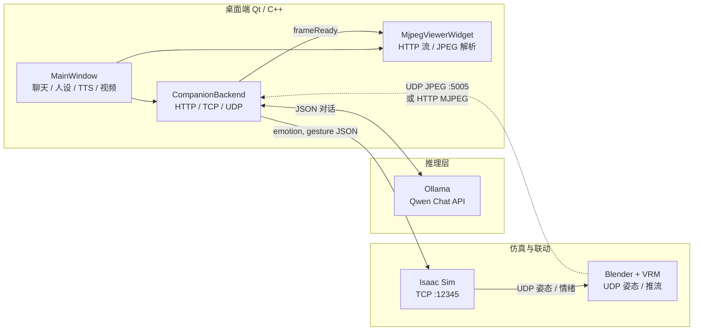

# EmoBot — 梦幻陪伴系统（Dream Companion）

全栈感知的 **数字人陪伴 + 具身联动** 实验项目：桌面端用 **C++/Qt** 做产品与编排，**大语言模型**负责对话与人设，**Isaac Sim / Blender** 负责机器人驱动与 VRM 可视化，并打通 **TTS、表情指令与实时画面回传**。

---

## 项目亮点（求职向摘要）

- **跨语言、跨进程产品层**：在 Qt Widgets 中完成聊天、人设、状态与多媒体控件，将原先分散在 Python 脚本中的 **LLM 调用、Isaac 指令下发、TTS 播放** 收敛到可发布的桌面形态，体现 **工程化与边界划分** 能力。
- **端侧大模型集成**：对接 **Ollama / Qwen** 的 HTTP Chat API，配合 **结构化 JSON 输出**（reply / emotion / gesture），并在 UI 层做 **容错解析**（代码块、非严格 JSON、安全降级），避免把原始字典暴露给用户。
- **多模态与实时链路**：支持 **HTTP MJPEG**（如 viewport/屏幕管线）与 **UDP JPEG 分片重组**（`FF D8`～`FF D9` 级拼帧），适配 Blender 侧不同推流方式；理解 **低延迟展示** 对陪伴类产品的重要性。
- **与仿真 / 视效管线联动**：通过 **TCP** 将语义层「情绪 + 动作」送到 Isaac Sim；仿真侧再通过 **UDP** 同步姿态与情绪到 Blender 中的 VRM，形成 **LLM → 控制 → 数字人表现** 的闭环思路。
- **交互与体验**：类即时通讯的 **气泡、未读提示、智能吸底滚屏**；**Edge-TTS + ffplay** 的语音播报与界面状态联动；资源与头像走 **Qt 资源系统**，便于分发。
- **可靠性与可维护性**：会话重置时的 **布局安全清理**（避免双重释放）；网络与流式协议的 **防御式解析**；提供 **无界面 `--selftest`** 做冒烟测试。

---

## 技术架构

整体采用 **「编排层（Qt/C++）+ 推理服务（Ollama）+ 仿真/视效（Python 生态）」** 的分层结构：C++ 负责 **I/O、状态机、网络、UI**；Python 脚本常驻仿真与 Blender 侧，专注 **领域逻辑与 DCC/仿真 API**。



**数据流简述**

| 方向 | 协议 / 形态 | 内容 |
|------|----------------|------|
| Qt → Ollama | HTTP `POST /api/chat` | 多轮 messages + system persona，模型输出结构化 JSON |
| Qt → Isaac Sim | TCP | `{"emotion","gesture"}`，驱动仿真侧行为与人设表现 |
| Isaac Sim → Blender | UDP | 骨骼姿态、情绪等，驱动 VRM |
| Blender / 中转 → Qt | UDP JPEG 或 HTTP MJPEG | 视口或合成画面回显到右侧面板 |
| Qt → 系统进程 | `QProcess` | `edge-tts` 脚本生成音频、`ffplay` 回放 |

**仓库目录（与架构对应）**

| 路径 | 角色 |
|------|------|
| `qt_companion/` | C++/Qt 主程序、MJPEG  viewer、TTS  glue、推流辅助脚本 |
| `server/` | Isaac Sim 侧控制与数据发送示例 |
| `src/` | 早期 Python 聊天与情绪转发逻辑（可与 Qt 能力对照） |
| `blender_bak/` | Blender 侧脚本与工程备份 |

---

## 本地运行

### Qt 客户端

```bash
cd qt_companion
qmake qt_companion.pro
make -j4
./EmobotQtCompanion
```

可选：`./EmobotQtCompanion --selftest` 在无界面下验证 Ollama 与嵌入资源。

### 视频

- **HTTP**：运行 `mjpeg_blender_server.py`（或兼容 `multipart/x-mixed-replace` 的 MJPEG 服务），默认 `http://127.0.0.1:8090/stream`。
- **UDP**：向 `127.0.0.1:5005` 发送 JPEG 字节（可多 UDP 包；程序按 JPEG 起止标记拼帧）。自测：`qt_companion/udp_jpeg_test_sender.py 某图.jpg`。

### 依赖

Qt 5（Widgets + Network）、Ollama、可选 `edge-tts` / `ffplay`；Isaac 侧 TCP `12345` 与仓库内脚本约定一致（可按环境修改主机与端口）。

---

## 许可说明

使用方式以学习、演示与求职作品展示为主；二次分发或商用请自行补齐各依赖（Qt、Ollama、模型权重、Isaac、VRM 资产等）的许可条款。
